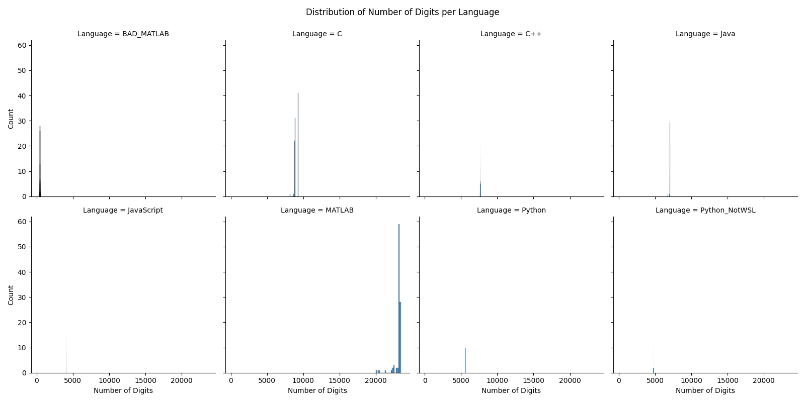

# Fibonacci Performance Benchmark



## Overview

This project aims to compare the performance of different programming languages in computing large Fibonacci numbers within a fixed time limit. The languages included in this benchmark are:

- Python
- C++
- C
- Java
- JavaScript
- MATLAB

The project involves:

- Implementing efficient Fibonacci number computations in each language.
- Running each implementation multiple times (e.g., 100 trials) with a fixed time limit (e.g., 1 second per trial).
- Recording the number of digits of the largest Fibonacci number computed within the time limit for each trial.
- Storing the results in CSV files for each language.
- Merging all results into a single CSV file (`results.csv`).
- Visualizing the results using various statistical plots saved in the `results` folder.

## Project Structure

- **Source Codes:**
  - `python.py` - Python implementation
  - `cpp.cpp` - C++ implementation
  - `c.c` - C implementation
  - `java.java` - Java implementation
  - `javascript.js` - JavaScript implementation
  - `matlab.m` - MATLAB implementation
- **CSV Files:**
  - `python.csv`
  - `cpp.csv`
  - `c.csv`
  - `java.csv`
  - `javascript.csv`
  - `matlab.csv`
  - `bad_matlab.csv` - Bad Matlab implementation
  - `python(NotWSL).csv` - Python results not on WSL 
  - `results.csv` - Merged results from all languages
- **Analysis Scripts:**
  - `analyze_results.py` - Script to merge CSV files and generate plots
  - `generate_plots.py` - Script to create visualizations and save them in the `results` folder
- **Results Folder:**
  - `results/` - Contains generated plots and visualizations
- **README:**
  - `README.md` - This file

## Requirements

### Language-Specific Requirements

- **Python:**
  - Python 3.x
  - Libraries: `time`, `math`, `statistics`, `csv`

- **C++:**
  - GCC compiler (g++)
  - Boost Multiprecision Library
  - Install Boost: `sudo apt install libboost-all-dev`

- **C:**
  - GCC compiler (gcc)
  - GMP Library
  - Install GMP: `sudo apt install libgmp-dev`

- **Java:**
  - Java Development Kit (JDK)
  - Install OpenJDK: `sudo apt install openjdk-17-jdk`

- **JavaScript:**
  - Node.js
  - Install Node.js: [Node.js Official Website](https://nodejs.org/en/download/)

- **MATLAB:**
  - MATLAB R2020a or newer
  - Symbolic Math Toolbox (if applicable)

### Analysis Requirements

- **Python Libraries:**
  - `pandas`
  - `matplotlib`
  - `seaborn`
  - `numpy`

  Install them using:

  ```bash
  pip install pandas matplotlib seaborn numpy
  ```

## Instructions

### Running Implementations

#### Python

1. Run the Python script:

   ```bash
   python python.py
   ```

2. This will generate `python.csv`.

#### C++

1. Compile the C++ code:

   ```bash
   g++ -std=c++11 -O2 cpp.cpp -o cpp
   ```

2. Run the executable:

   ```bash
   ./cpp
   ```

3. This will generate `cpp.csv`.

#### C

1. Compile the C code:

   ```bash
   gcc -O2 c.c -o c -lgmp -lm
   ```

2. Run the executable:

   ```bash
   ./c
   ```

3. This will generate `c.csv`.

#### Java

1. Compile the Java code:

   ```bash
   javac java.java
   ```

2. Run the program:

   ```bash
   java java
   ```

3. This will generate `java.csv`.

#### JavaScript

1. Run the JavaScript script:

   ```bash
   node javascript.js
   ```

2. This will generate `javascript.csv`.

#### MATLAB

1. Open MATLAB.
2. Run the MATLAB script `matlab.m`.
3. This will generate `matlab.csv`.

### Merging Results

1. Ensure all individual CSV files are present in the directory.
2. Run the analysis script to merge CSV files:

   ```bash
   python analyze_results.py
   ```

   - Make sure `mergeBool` is set to `True` in the script for merging.

3. This will generate `results.csv`.

### Generating Visualizations

1. Run the script to generate plots:

   ```bash
   python generate_plots.py
   ```

2. This will create a `results` folder containing all the visualization PNG files.

## Visualizations

The following plots are generated and saved in the `results` folder:

1. **Box Plot** (`box_plot.png`): Shows the distribution of the number of digits computed per language.
2. **Violin Plot** (`violin_plot.png`): Displays the distribution and density of the data for each language.
3. **Box Plot with Data Points** (`box_plot_with_data_points.png`): Overlays individual data points on the box plot.
4. **Bar Plot with Error Bars** (`bar_plot_with_error_bars.png`): Shows the mean number of digits with standard deviation error bars for each language.
5. **ECDF Plot** (`ecdf_plot.png`): Plots the empirical cumulative distribution function for each language.
6. **Faceted Histograms** (`faceted_histograms.png`): Individual histograms for each language.
7. **Combined Bar Plot and Box Plot** (`combined_bar_box_plot.png`): Combines mean values with box plots to show distributions.

## Project Workflow

1. **Implement Fibonacci Computation in Each Language:**
   - Use efficient algorithms (e.g., fast doubling method).
   - Ensure the code handles large integers (arbitrary precision).

2. **Run Experiments:**
   - Set a time limit (e.g., 1 second per trial).
   - Run multiple trials (e.g., 100 trials).
   - Record the number of digits of the largest Fibonacci number computed within the time limit.

3. **Collect Results:**
   - Store results in CSV files for each language.
   - Each CSV file should have the columns: `Language`, `Trial`, `Number of Digits`.

4. **Merge Results:**
   - Use `analyze_results.py` to merge individual CSV files into `results.csv`.

5. **Analyze and Visualize Data:**
   - Use `generate_plots.py` to create visualizations.
   - Review plots to compare performance across languages.

## Notes and Considerations

- **Handling Large Integers:**
  - Ensure that each language implementation uses appropriate libraries or data types to handle large Fibonacci numbers (e.g., `BigInteger` in Java, `BigInt` in JavaScript, `boost::multiprecision::cpp_int` in C++).

- **Performance Optimization:**
  - Use efficient algorithms and data structures.
  - Avoid unnecessary computations within the time-critical loop.
  - Disable debug outputs or logs during performance measurement.

- **Consistency:**
  - Use the same time limit and number of trials across all languages for fair comparison.
  - Ensure that all CSV files have the same format.

- **Environment:**
  - Performance can vary based on system specifications and current load.
  - Run experiments on the same machine under similar conditions when possible.

## Conclusion

This project provides insights into the computational efficiency of different programming languages when performing intensive numerical calculations involving large integers. By analyzing the results and visualizations, you can assess the strengths and weaknesses of each language in handling such tasks.
